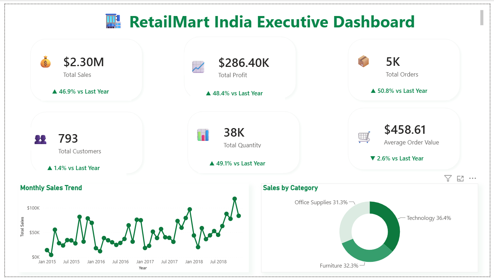
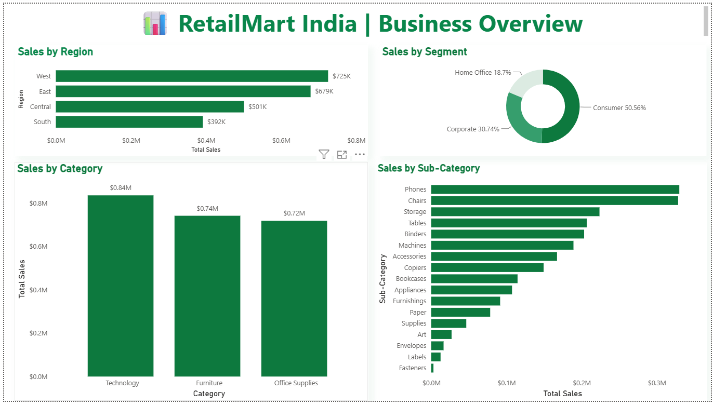
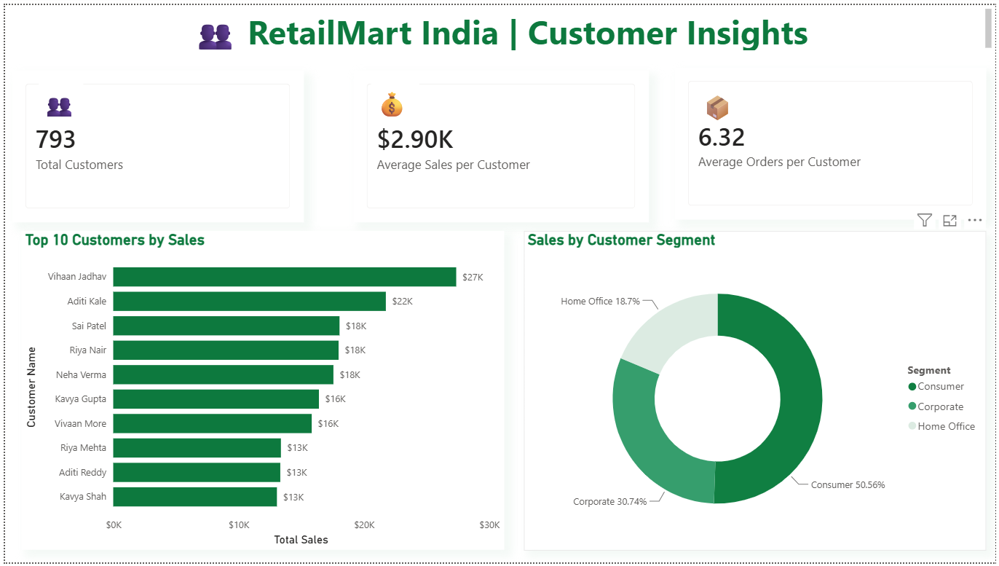
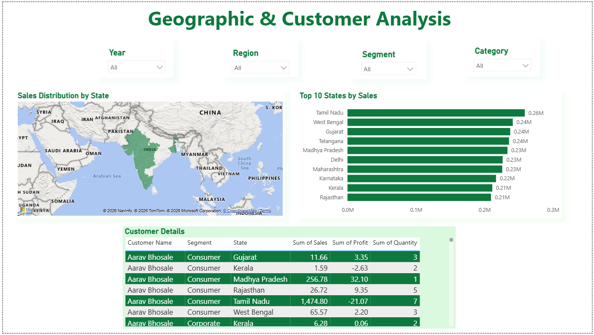

# 🛒 RetailMart India Sales & Business Analytics | Power BI + SQL Project

## 📌 Project Overview

RetailMart India Sales & Business Analytics Dashboard is an end-to-end Business Intelligence project developed using **MySQL** and **Microsoft Power BI**.

The objective of this project is to analyze retail sales data, evaluate business performance, identify customer purchasing patterns, and generate actionable insights through interactive Power BI dashboards.

This project demonstrates SQL-based data analysis, KPI development, data modeling, DAX measures, and professional dashboard design.

## 🌟 Project Highlights

- End-to-End Business Analytics Project
- Interactive Power BI Dashboard
- SQL Data Analysis
- Professional KPI Design
- Customer & Geographic Analysis
- Business Insights for Decision Making

## 🎯 Business Problem

Retail businesses generate large volumes of sales data every day. Without proper analysis, it becomes difficult to answer questions like:

- Which regions generate the highest revenue?
- Which products perform best?
- Who are the most valuable customers?
- Which states contribute the most sales?
- How is business growing over time?

This dashboard helps decision-makers answer these questions quickly through interactive visualizations.

---

## 🛠️ Tech Stack

- Microsoft Power BI Desktop
- MySQL
- SQL
- DAX
- Power Query
- Microsoft Excel
- Data Modeling
---

## 📊 Dashboard Pages

### 1️⃣ Executive Dashboard

Provides an overall business summary including:

- Total Sales
- Total Profit
- Total Orders
- Total Customers
- Average Order Value
- Monthly Sales Trend

---

### 2️⃣ Business Overview

Includes analysis of:

- Sales by Region
- Sales by Category
- Sales by Sub-category
- Customer Segments

---

### 3️⃣ Customer Insights

Analyzes:

- Top Customers
- Customer Segments
- Average Sales per Customer
- Average Orders per Customer

---

### 4️⃣ Geographic Analysis

Provides:

- Sales Distribution by State
- Top States by Sales
- Customer Details
- Interactive Filters

---

# 📈 Key Performance Indicators (KPIs)

The dashboard tracks the following business metrics:

- 💰 Total Sales
- 📈 Total Profit
- 📦 Total Orders
- 👥 Total Customers
- 🛒 Total Quantity Sold
- 💸 Average Discount
- 📊 Average Sales per Customer
- 📦 Average Orders per Customer

---

# ✨ Key Features

- Interactive dashboard with slicers
- Dynamic KPI cards
- Drill-down analysis
- Customer segmentation
- Regional performance analysis
- Product category analysis
- Geographic sales visualization
- Customer-level analysis
- Professional dashboard design

---

# 📁 Repository Structure

```text
RetailMart-India-Business-Analytics
│
├── Dashboard
│   └── RetailMart_India_Project.pbix
│
├── Dataset
│   ├── retailmart_orders.csv
│   ├── retailmart_people.csv
│   └── retailmart_returns.csv
│
├── SQL
│
├── Screenshots
│
├── Documentation
│
├── README.md
└── LICENSE
```

---

# 🎯 Skills Demonstrated

This project demonstrates practical experience with:

- SQL Data Analysis
- Data Cleaning
- Data Modeling
- DAX Measures
- Power Query
- Dashboard Design
- Business Intelligence
- Data Visualization
- Business Storytelling
- KPI Development

---

# 💡 Business Insights

The dashboard enables stakeholders to:

- Identify the highest-performing sales regions.
- Compare product category performance.
- Discover the top revenue-generating customers.
- Analyze customer segments and purchasing behavior.
- Track monthly sales trends.
- Evaluate sales distribution across Indian states.

# 📈 Business Impact

This dashboard helps business stakeholders:

- Monitor overall business performance.
- Identify profitable regions and product categories.
- Improve customer targeting strategies.
- Track KPIs using interactive dashboards.
- Support data-driven business decisions.

# 🚀 How to Use

1. Clone this repository.
2. Open the `.pbix` file using Microsoft Power BI Desktop.
3. Connect the dashboard to the provided dataset if required.
4. Explore the interactive reports using slicers and filters.

---

# 📸 Dashboard Preview

## Executive Dashboard



---

## Business Overview



---

## Customer Insights



---

## Geographic & Customer Analysis



---

Hi, I'm **Trupti Unde**, an aspiring Business Analyst passionate about using data to solve business problems through SQL, Power BI, Excel, and Business Intelligence.

I enjoy building interactive dashboards that help organizations make better data-driven decisions.
# ⭐ If you found this project useful

Please consider giving this repository a ⭐ on GitHub.

Thank you for visiting!
